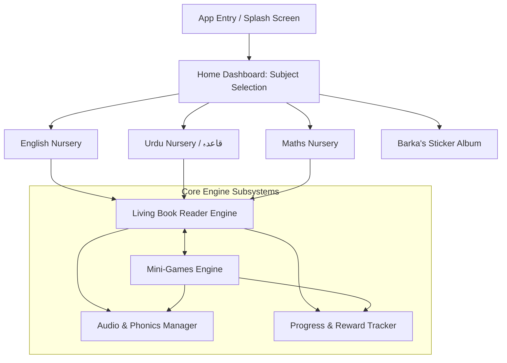

# Barka's Book — Architecture & Technical Design Document

**Application Name:** Barka's Book (بارکہ کی کتاب)  
**Initial Target Learner:** Barka Faral (Playgroup / Nursery, Ages 3–4)  
**Expansion Roadmaps:** Pakistan Single National Curriculum (SNC / PCTB Kindergarten), Oxford Pre-Primary, and private school boards  
**Primary Platform:** Android (Tablet & Mobile, Offline-First)  
**Core Framework:** Flutter (Dart)  

---

## 1. Executive Summary & Vision

Children in early childhood (Playgroup / Nursery / KG) learn best through multi-sensory association: visual illustration, phonetic audio, and tactile interaction. **Barka's Book** bridges physical school textbooks with digital interactivity. 

Instead of passive video watching or disconnected flashcards, the app provides a **"Living Book"** experience:
1. **Familiarity:** Digital pages mirror the physical lessons of Barka Faral's actual nursery school curriculum.
2. **Interactivity:** Illustrations come alive with motion animations and sound effects upon touch (e.g., a cat blinks and purrs, a ball bounces, an apple falls).
3. **Phonics & Pronunciation:** Every word and letter provides crystal-clear audio pronunciation with localized phonics (both English Phonics and authentic Urdu Huruf pronunciation).
4. **Gamified Retention:** Each unit contains embedded mini-games (Finger Tracing, Drag-and-Drop Matching, Listen-and-Pop Phonics quizzes) and rewards the learner with stars in "Barka's Sticker Album".
5. **Zero-Latency Offline-First:** 100% functional without an active internet connection, designed for high responsiveness on budget Android tablets and smartphones.
6. **100% Free & Open Educational Gift:** Completely free forever. Zero paywalls, zero subscriptions, zero ads, and zero locked features. Every child has equal access to quality early learning.

---

## 2. System Architecture

The application adopts a **Data-Driven Feature-First Architecture**. The reading engine and mini-games do not hardcode book pages; instead, they parse declarative JSON manifests. Adding a new chapter, grade, or entire school board (e.g., Punjab Textbook Board) requires only a new content manifest and asset pack.



---

## 3. Directory & Module Structure

```
barka_book/
├── assets/
│   ├── books/
│   │   ├── barka_nursery/                     # Barka Faral's Initial Syllabus
│   │   │   ├── english_manifest.json          # A-Z, Phonics, First Words
│   │   │   ├── urdu_manifest.json             # Alif to Yay (ا تا ے), Phonics, Qayda Words
│   │   │   └── maths_manifest.json            # Numbers 1-10, Shapes, Colors
│   │   └── snc_kindergarten/                  # Future: Govt Single National Curriculum
│   ├── audio/
│   │   ├── sfx/                               # Tap, pop, cheer, applause, page-flip, bell
│   │   ├── english/                           # Phonics (/æ/, /b/, /k/) + Words (Apple, Ball...)
│   │   ├── urdu/                              # Huruf (/alif/, /bay/...) + Words (Anaar, Billi...)
│   │   └── maths/                             # Number pronunciations + Shape names
│   ├── animations/                            # Lottie (.json) & Rive (.riv) motion vector graphics
│   ├── images/                                # High-res optimized WebP illustrations
│   └── fonts/
│       ├── JameelNooriNastaleeq.ttf           # Authentic Urdu Nastaliq typography
│       ├── NotoNastaliqUrdu-Bold.ttf          # Standard Nastaliq for headings
│       └── Quicksand-Bold.ttf                 # Friendly, rounded English/Maths typography
├── lib/
│   ├── core/
│   │   ├── audio/
│   │   │   ├── audio_controller.dart          # Low-latency SFX & Voiceover dispatcher
│   │   │   └── audio_cache_service.dart       # Pre-loads critical sounds into RAM
│   │   ├── localization/
│   │   │   └── rtl_direction_helper.dart      # Seamless LTR (English) <-> RTL (Urdu) transitions
│   │   ├── theme/
│   │   │   ├── app_colors.dart                # High-contrast, kid-friendly palette
│   │   │   └── text_styles.dart               # Pre-configured Nastaliq and rounded English styles
│   │   └── storage/
│   │       └── progress_repository.dart       # Hive / SharedPreferences offline database
│   ├── features/
│   │   ├── home/
│   │   │   ├── presentation/
│   │   │   │   └── screens/home_screen.dart   # Interactive subject bookshelf & Barka's avatar
│   │   ├── book_engine/
│   │   │   ├── data/
│   │   │   │   ├── models/book_manifest.dart  # JSON parser for pages, hotspots & games
│   │   │   │   └── book_repository.dart       # Loads and caches local book manifests
│   │   │   └── presentation/
│   │   │       ├── screens/book_reader_screen.dart
│   │   │       └── widgets/
│   │   │           ├── animated_hotspot.dart  # Tap-to-animate interactive vector image
│   │   │           ├── word_speech_badge.dart # Tap-to-pronounce phonetic pill
│   │   │           └── page_flip_control.dart # Fluid horizontal page turner
│   │   ├── games/
│   │   │   ├── tracing/
│   │   │   │   ├── screens/tracing_screen.dart
│   │   │   │   └── widgets/tracing_canvas.dart# CustomPainter stroke-detector with sparkle trails
│   │   │   ├── matching/
│   │   │   │   ├── screens/matching_game_screen.dart
│   │   │   │   └── widgets/drag_target_card.dart
│   │   │   └── balloon_pop/
│   │   │       ├── screens/balloon_pop_screen.dart
│   │   │       └── widgets/floating_balloon.dart
│   │   └── rewards/
│   │       ├── presentation/
│   │       │   └── screens/sticker_album_screen.dart # "Barka's Toy Box" collectible rewards
│   │       └── data/models/sticker_item.dart
│   └── main.dart
```

---

## 4. Content Schema: Declarative Book Manifest

Each curriculum book is governed by a declarative JSON contract. This completely decouples content authoring from Flutter code.

### Example: `assets/books/barka_nursery/english_manifest.json`
```json
{
  "bookId": "barka_nursery_english",
  "title": "Barka's English Phonics & Words",
  "subject": "english",
  "grade": "nursery",
  "isRtl": false,
  "pages": [
    {
      "pageNumber": 1,
      "letter": "A",
      "phonicsSound": "audio/english/phonics/a.ogg",
      "phonicsDescription": "/æ/ as in Apple",
      "mainIllustration": {
        "assetPath": "assets/animations/apple.json",
        "type": "lottie",
        "interactiveSfx": "audio/sfx/apple_crunch.ogg",
        "motionTrigger": "tap_wobble_and_bounce"
      },
      "vocabularyWords": [
        {
          "word": "Apple",
          "audio": "audio/english/words/apple.ogg",
          "color": "#FF4B4B"
        },
        {
          "word": "Ant",
          "audio": "audio/english/words/ant.ogg",
          "color": "#795548"
        }
      ],
      "miniGame": {
        "type": "tracing",
        "targetSymbol": "A",
        "guidePoints": [
          {"x": 0.5, "y": 0.2},
          {"x": 0.2, "y": 0.8},
          {"x": 0.5, "y": 0.2},
          {"x": 0.8, "y": 0.8},
          {"x": 0.35, "y": 0.55},
          {"x": 0.65, "y": 0.55}
        ]
      }
    }
  ]
}
```

### Example: `assets/books/barka_nursery/urdu_manifest.json`
```json
{
  "bookId": "barka_nursery_urdu",
  "title": "بارکہ کا اردو قاعدہ",
  "subject": "urdu",
  "grade": "nursery",
  "isRtl": true,
  "pages": [
    {
      "pageNumber": 1,
      "letter": "ا",
      "phonicsSound": "audio/urdu/phonics/alif.ogg",
      "phonicsDescription": "الف",
      "mainIllustration": {
        "assetPath": "assets/animations/pomegranate.json",
        "type": "lottie",
        "interactiveSfx": "audio/sfx/pop_chime.ogg",
        "motionTrigger": "tap_squish_and_grow"
      },
      "vocabularyWords": [
        {
          "word": "انار",
          "audio": "audio/urdu/words/anaar.ogg",
          "color": "#E91E63"
        },
        {
          "word": "انگور",
          "audio": "audio/urdu/words/angoor.ogg",
          "color": "#4CAF50"
        }
      ],
      "miniGame": {
        "type": "balloon_pop",
        "targetSound": "audio/urdu/phonics/alif.ogg",
        "correctSymbol": "ا",
        "distractorSymbols": ["ب", "ت", "ج"]
      }
    }
  ]
}
```

---

## 5. Subsystem Specifications

### 5.1. "Living Book" Page Engine
* **Visual Presentation:** A double-page or single-card responsive viewport supporting phones ($16:9$, $20:9$) and tablets ($4:3$, $16:10$).
* **Hotspot Interactivity:** Tapping any illustration triggers an animated reaction (wobble, jump, scale bounce via `flutter_animate` or Lottie trigger) accompanied by synchronized audio SFX.
* **Word Phonics:** Tapping any vocabulary pill plays the word pronunciation immediately. Tapping the large letter card plays the individual phonetic sound.
* **Page Navigation:** Big, kid-friendly arrow buttons and smooth horizontal swipe gestures. Includes an auditory page-turning swoosh sound.

### 5.2. Urdu Nastaliq & Bi-directional Support
* **Typography:** Integrated `Noto Nastaliq Urdu` and `Jameel Noori Nastaleeq` for authentic Pakistani Urdu script rendering without broken letter connections.
* **Layout Mirroring:** When an Urdu book is active, the entire reader automatically pivots to Right-to-Left (RTL) mode:
  * Page 1 starts from the right (as in traditional Pakistani Urdu Qaydas).
  * Swipe forward moves from left to right.
  * Tracing paths follow natural Urdu pen-stroke conventions (e.g. Alif top-to-bottom, Bay right-to-left curve).

### 5.3. Embedded Mini-Games Engine
1. **Letter & Number Finger Tracing (`CustomPainter`):**
   * Displays dotted guide paths with numbered starting beacons.
   * As the child moves their finger, a sparkling rainbow/star particle trail is drawn.
   * Path completion algorithm verifies checkpoint proximity ($>80\%$ coverage triggers success fanfare, fireworks particle effect, and audio cheer).
2. **Drag & Match Game:**
   * Left column: Letters/Huruf (e.g. $A, B, C$ or ا، ب، پ).
   * Right column: Illustrated target cards (Apple, Ball, Cat or انار، بلی، پتنگ).
   * Kid drags the item to its matching target; haptic feedback and positive chime on match.
3. **Listen & Pop Phonics Quiz:**
   * Speaker says: *"Pop the letter 'B'!"* (or *"'بے' تلاش کریں!"*).
   * Floating balloons float upwards across the screen containing different letters.
   * Tapping the correct balloon pops it with a burst animation and confetti.

### 5.4. Audio Subsystem
* **Audio Channels:**
  1. `Voiceover Channel`: High-priority channel for clear speech and phonics. Automatically ducks/pauses background sounds.
  2. `SFX Channel`: Concurrent low-latency channel for taps, pops, correct chimes, and celebrations.
  3. `BGM Channel`: Gentle, acoustic nursery background melody (volume at $20\%$, toggleable via parental settings).
* **Caching Strategy:** All frequently used sound effects (pops, dings, cheers, page-flips) are pre-cached in memory on startup so there is zero audio delay on button presses.

### 5.5. Offline Storage & Gamification ("Barka's Sticker Album")
* **Storage Engine:** Lightweight `hive_flutter` local key-value store. No user login or passwords required.
* **Progress Tracking:** Tracks completed pages, stars earned per lesson, and highest scores in mini-games.
* **Reward Mechanism:** Each completed lesson grants a gold star and unlocks a playful interactive sticker (e.g., animated teddy bear, rocket, butterfly, cartoon kitten) into **Barka's Toy Box**.

---

## 6. Educational Scope (Nursery / Playgroup Phase 1)

| Subject | Scope / Key Competencies | Interactive Assets |
| :--- | :--- | :--- |
| **English** | Alphabet ($A$ to $Z$), Letter recognition (Capital & Small), Phonic sounds (/æ/, /b/, /k/...), 52 Core Nursery vocabulary words. | 26 Living Book pages + 26 Tracing challenges + Matching games. |
| **Urdu (اردو)** | Huruf-e-Tahajji (ا تا ے), Phonetic pronunciation, Primary Qayda vocabulary (انار، بلی، پنکھا، تتلی، ٹماٹر...), Letter tracing. | 37 Living Book pages + 37 Nastaliq tracing paths + Balloon pop quizzes. |
| **Maths (ریاضی)** | Numbers $1$ to $10$, Object counting playground, Basic Shapes (Circle, Square, Triangle, Star), Primary Colors. | 10 Counting pages + Shape sorter + Interactive fruit basket counter. |

---

## 7. Quality Attributes & Non-Functional Requirements

1. **Child Usability (Age 3–4):**
   * Giant touch targets (minimum $64 \times 64$ dp).
   * No complex text-based menus; all navigation is icon-driven with clear audio prompts.
   * Accidental tap guard (ignoring accidental multi-touch palm resting on screen).
2. **Performance:** 
   * Consistent 60 fps rendering on Android devices with 2GB RAM.
   * Cold startup time $< 2.5$ seconds.
3. **100% Free & Child-Safe Philosophy:**
   * **Zero In-App Purchases (IAP):** No paywalls or subscriptions. All lessons, books, and sticker rewards are earned purely through learning progression.
   * **Zero Advertisements:** 100% Ad-free. No commercial banners, popups, or video ads that distract toddlers or risk inappropriate exposure (fully COPPA compliant).
   * **Zero Operational/Server Costs:** Because all content, manifests, and progress tracking run locally on the device (offline-first), maintaining and distributing the app costs \$0 in cloud hosting fees.
   * **Zero Distractions:** No external web links without an intentional parental math-lock gate.
4. **Offline Capability:**
   * Works completely offline with zero internet access once installed.
